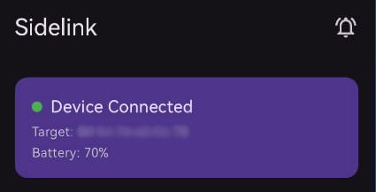
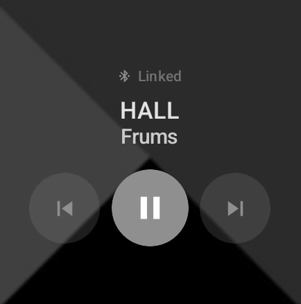
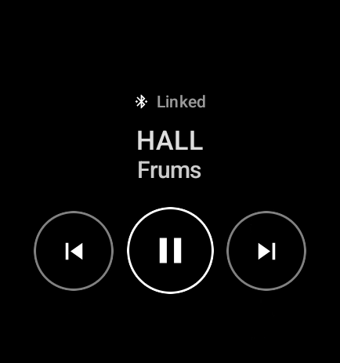
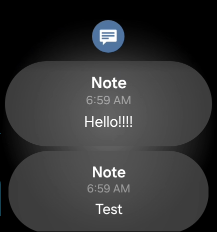

# Sidelink

A phone-to-watch notification mirroring app using pure Bluetooth RFCOMM. No Google services, no servers, no accounts. Primarily made for secondary or unsupported phones that don't have official watch companion support.

**Features:**
- Notification mirroring with app icons
- Reply and dismiss from the watch
- Media controls with album art
- Volume adjustment with haptic feedback
- Watch battery display on phone
- App filtering and blacklist
- Auto reconnect
- Notification caching (sends missed notifs after reconnect)
- Set and forget, runs silently in the background

> No data is sent to any server. Everything stays between your phone and watch over Bluetooth.

---

## Screenshots
   
<!-- Add screenshots here -->

---

## Requirements

- Android phone running **Android 11 (API 30)** or higher
- Wear OS watch running **Wear OS 3** or higher
- Watch must be **Bluetooth paired** to the phone before setup

---

## Installation

### Phone

1. Download and install the phone `.apk` 
2. Grant the permissions shown at first launch
3. Select your paired watch from the dropdown
4. Connect!

### Watch 

1. Transfer the watch `.apk` to your watch (recommended: [File Browser by Orienlabs](https://play.google.com/store/apps/details?id=com.orienlabs.filebrowser.wear) to import)
2. Install the .apk (recommended:[AnExplorer](https://play.google.com/store/apps/details?id=dev.dworks.apps.anexplorer)) 
3. Grant the permissions shown at first launch
4. Should be ready for connections

---
## Usage
-In the watch app, volume controlled with rotating bezel.
-The media controller in the watchface can be disabled from android settings.

## How does it work?

The phone app runs a `NotificationListenerService` that intercepts incoming notifications and streams them to the watch over a Bluetooth RFCOMM connection. No Google services or cloud infrastructure is involved, it's a direct socket connection between devices.

Messages are JSON sent over a persistent connection with a ping/pong keepalive. The watch receives notifications and posts them natively, so they show up just like any other watch notification with reply and dismiss support.

---

## Known limitations

- Depending on the phone/wear model, OS can kill the service freely.
- Watch must be paired to the phone via system Bluetooth settings before use
